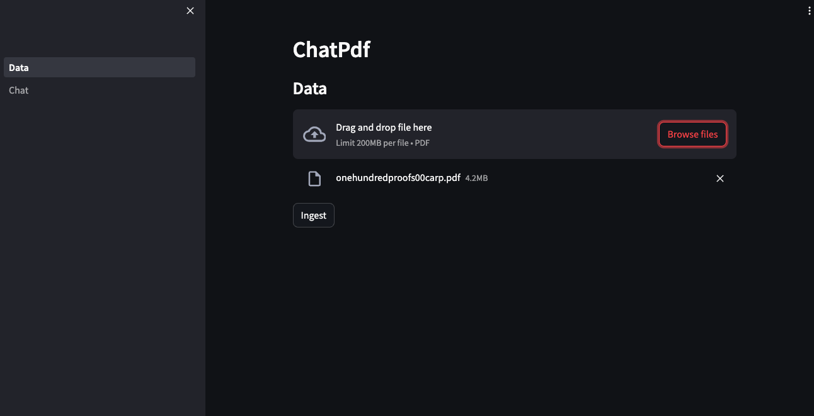

Llamaindex implementation for a simple RAG (Retrieval-Augmented Generation).

Supported LLM:
- OpenAI
- Azure OpenAI

Supported vector database:
- local disk
- Pinecone
- Azure AISearch

## Setup
Rename sample.env to .env and fill with your API Keys

## Running
```
pip install -r requirements.txt
streamlit run Data.py
```

View demo at [HuggingFace](https://huggingface.co/spaces/dodyw/simple-rag)

Contact me at [LinkedIn](https://www.linkedin.com/in/dodywicaksono)